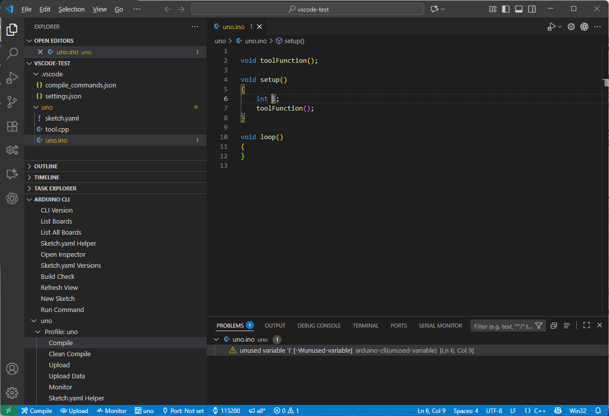
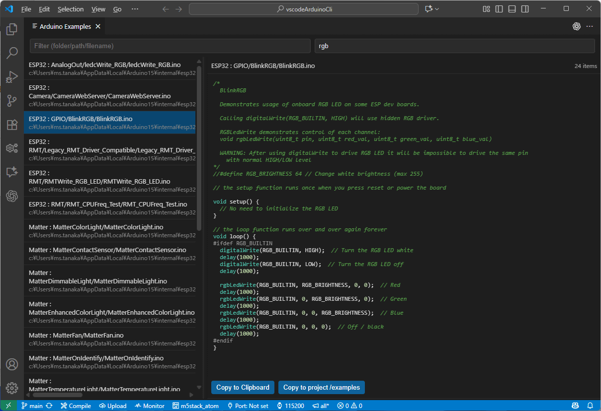

# Arduino CLI Wrapper (VS Code 拡張機能)

[English README](README.md)

Arduino CLI を VS Code から「コマンドパレット」「ステータスバー」「エクスプローラー」から操作できます。カラー付きの疑似ターミナルにログを集約し、sketch.yaml のプロファイルに対応、ビルド中に IntelliSense の includePath を自動更新します。



*エクスプローラービューからスケッチやプロファイル、各種操作をワンクリックで実行できます。*

## コンセプト

この拡張機能は、Arduino IDE の内部で呼び出されている Arduino CLI を VS Code から直接扱えるようにし、IDE と同等以上の操作性を目指しています。Arduino CLI が備えるプロファイル機能を活用すると、`sketch.yaml` にプラットフォームやライブラリのバージョンを明示してプロジェクトごとに切り替え管理できます。IDE では複数バージョンの使い分けが難しかった部分ですが、拡張機能では編集ヘルパーや最新バージョンとの差分チェックを通じて初心者でも簡単に扱えます。

エディタとして VS Code を活用しているため、マイクロソフト製 C/C++ 拡張機能と連携し、ビルド結果を IntelliSense や診断情報（エラー・警告）へ即座に反映します。生成される `compile_commands.json` も常に最新の状態に保たれ、強力な C/C++ コーディング支援を受けられます。また、Arduino IDE の既定が `none` となっているワーニング設定に対し、ワークスペース内のファイルだけを対象にする独自の「workspace (all*)」モードを追加し、ノイズの多い外部ライブラリの警告を抑制します。

さらに ESP32 向けの `data/` フォルダー書き込み機能や、map ファイルなどを解析する Inspector など IDE にはないユーティリティも搭載。Arduino CLI をこれから学ぶ人にも、プロフェッショナルな開発フローを求める人にも便利な環境を提供します。

## クイックスタート

1) Arduino CLI の準備
- `PATH` に通すか、設定 `arduino-cli-wrapper.path` に実行ファイルのフルパスを指定。
- 「Arduino CLI: Check CLI Version」で認識確認（未設定ならガイドを表示）。
  - Windows: インストーラー https://downloads.arduino.cc/arduino-cli/arduino-cli_latest_Windows_64bit.msi または `winget install ArduinoSA.CLI`
  - Linux / macOS: https://arduino.github.io/arduino-cli/latest/installation/

  ### 推奨 VS Code 拡張機能

  この拡張機能は `extensionPack` で以下の VS Code 拡張機能を推奨しています。開発体験を高めるため、用途に応じてインストールしてください。

  - **C/C++ (ms-vscode.cpptools)** – IntelliSense、コード補完、既定の `cppdbg` デバッガーなど、C/C++ 言語を扱うのに必須となる基本機能を提供します。Arduino CLI Wrapper を使う場合は常に導入しておくことをおすすめします。
  - **Cortex-Debug (marus25.cortex-debug)** – レジスタやペリフェラルビュー、メモリマップ表示など高度なハードウェアデバッグ機能を備えています。本格的なデバッグを行う場合に導入してください。簡易的なデバッグしか行わない、あるいはデバッグ機能を使わない場合は必須ではありません。

2) スケッチフォルダーを開く
- `.ino` を含むフォルダーを開くと、Compile/Upload/Monitor と FQBN/Port/Baud/Warn がステータスバーに表示されます。

3) コンパイル / 書き込み / モニタ
- コンパイル: 「Arduino CLI: Compile Sketch」または Compile をクリック。
- 書き込み: 「Arduino CLI: Upload Sketch」または Upload をクリック。先にポートを選択してください（プロファイル使用時でも `-p` で明示指定）。
- モニタ: 「Arduino CLI: Monitor Serial」または Monitor をクリック。ボーレートは既定 115200、ステータスバーから変更できます。

ヒント:
- `.ino` が複数あるときは選択ダイアログが出ます。アクティブな `.ino` エディターがあれば優先されます。
- FQBN を自動取得できない場合は手入力できます。

### `arduino_secrets.h` の管理

`.ino` ファイルに `#include "arduino_secrets.h"` が含まれている場合、インクルード行の上にインラインアクションを表示します。既存ファイルがあればワンクリックで開き、未作成ならフォールバックの `#define` 行を抽出して初期値付きのヘッダーを生成するため、Wi-Fi 認証情報などをソース本体から容易に切り離せます。

## WSL を使ったビルド高速化ガイド

Windows 上で Arduino CLI のコンパイルが遅いときは、WSL (Windows Subsystem for Linux) に Linux 環境を作り、ビルドだけを高速な Linux 上で行う構成が便利です。この拡張機能はコンパイル時に WSL 側の `arduino-cli` を利用しつつ、Upload / Monitor だけを Windows ネイティブの `arduino-cli.exe` に自動で切り替えるため、シリアルポート設定を二重管理する必要がありません。手順は次のとおりです。

1. **WSL と Linux ディストリビューションをインストール**
   ```powershell
   # PowerShell (管理者) で実行
   wsl --install -d Ubuntu-24.04
   wsl --set-default-version 2
   ```
   インストール後、初回起動でユーザー名とパスワードを設定します。既に WSL を利用している場合はこのステップをスキップできます。

2. **WSL 内に Arduino CLI をセットアップ**
   ```bash
   # WSL (Ubuntu) ターミナル内
   sudo apt update
   curl -fsSL https://raw.githubusercontent.com/arduino/arduino-cli/master/install.sh | sh
   sudo mv bin/arduino-cli /usr/local/bin/
   arduino-cli config init
   arduino-cli core update-index
   ```
   `arduino-cli version` コマンドでインストールが完了しているか確認してください。

3. **VS Code から WSL リモートへ接続**
   - VS Code のコマンドパレットから “Remote-WSL: 新しいウィンドウで開く” を選び、Ubuntu 環境を開きます。
   - この拡張機能を WSL 側にもインストールします (初回起動時に VS Code から確認ダイアログが出ます)。
   - 設定 `arduino-cli-wrapper.path` が空の場合は、WSL の `arduino-cli` を自動検出して利用します。明示的に指定したい場合は `arduino-cli` のフルパス (`/usr/local/bin/arduino-cli` など) を入力してください。

4. **WSL 上でビルドする**
   - WSL 上のワークスペースで `.ino` を含むフォルダーを開きます。
   - 「Arduino CLI: Compile Sketch」を実行すると、WSL の `arduino-cli` が使用されます。ビルド成果物は Linux のファイルシステム上 (例: `/home/<user>/.arduino15/...`) に作成されます。

5. **アップロード / モニタは Windows 側を自動利用**
   - この拡張機能は WSL 環境でも、Upload / Monitor コマンドを実行すると自動的に Windows 側の `arduino-cli.exe` を起動し、`COM` ポートへ直接接続します。WSL でシリアルポートを設定する必要はありません。

6. **Update Data / Debug の制限と対処**
   - `Arduino CLI: Upload Data` と `Arduino CLI: Debug` は、WSL から Windows ホストのシリアルポートへ直接アクセスできないため利用できません。
   - 対処方法は以下のいずれかです。
     1. `usbipd-win` などを用いて Windows の USB デバイスを WSL 側に転送し、WSL 内でポートを認識させてから実行する。
        ```powershell
        # PowerShell (管理者) でホスト側デバイスをエクスポート
        usbipd wsl list
        usbipd wsl attach --busid <BUSID>
        ```
        ```bash
        # WSL 内で接続を確認
        ls /dev/tty*
        ```
     2. もしくは Windows 側の VS Code / Arduino CLI で `Upload Data` や `Debug` を実行する。

7. **トラブルシューティング**
   - `Latest arduino-cli: (unknown)` と表示された場合、GitHub API のレート制限に引っかかっています。`GITHUB_TOKEN` を VS Code の環境変数に設定するか、しばらく時間を空けて再試行してください。
   - COM ポートが表示されないときは、Windows 側でボードが正しく認識されているか (デバイスマネージャー) を確認し、必要であればドライバーを再インストールしてください。

これらの手順を踏むことで、コンパイルは WSL の高速な Linux 環境で実行しつつ、アップロードとシリアルモニターは Windows から直接行うハイブリッド運用が可能になります。

## 上級者向けカスタマイズ

### オプション: `.arduino-cli-flags`（本拡張機能専用）

コンパイル毎に追加の `build.extra_flags` を自動注入する必要がある場合のみ、スケッチと同じフォルダーに `.arduino-cli-flags` を置けます。**この仕組みは Arduino CLI Wrapper 専用で、他の IDE や拡張機能からは一切認識されません。まずは `arduino_secrets.h` など汎用的な方法で管理し、それでも不足するケースに限って利用する上級者向けのエスケープ手段として扱ってください。**

- 1 行につき 1 個のフラグを書きます（例: `-DWIFI_SSID="MySSID"`）。
- `#` または `//` で始まる行と空行は無視されます。
- 有効な行はスペース区切りで連結され、`--build-property build.extra_flags=...` として渡されます。
- 既に設定、タスク、コマンドパレットなどで `build.extra_flags` を指定している場合はそちらが優先され、ファイルは読み込まれません。

ドットから始まるファイル名のため既定では隠しファイルとして扱われます。認証情報がコミットに含まれないよう、必要に応じて `.gitignore` へ追加してください（本拡張の `.gitignore` には既にエントリを用意済みです）。

## 日常操作と UI

### コマンドパレットから始める（初心者ガイド）

**Ctrl+Shift+P**（macOS は **Cmd+Shift+P**）でコマンドパレットを開き、「Arduino CLI」と入力すると下記のコマンドが並びます。それぞれのコマンドに何が起きるのかを、初めての方でも分かるようにまとめました。

- **CLI バージョン確認** – `arduino-cli` がインストールされているかチェックします。未設定なら手順付きのガイドが表示されます。
- **List Connected Boards** – PC に接続されている Arduino ボードを一覧表示し、書き込み前に接続状況を確認できます。
- **List All Boards** – すべてのボードを検索できます。フィルター欄にキーワードを入力すると `arduino-cli board listall <filter>` と同じ結果が得られます。
- **Board Details** – 現在選択中のプロファイル/FQBN の詳細情報を表示し、使用しているボード設定を再確認できます。
- **Compile Sketch** – アクティブなスケッチをビルドします。複数の `.ino` があるときは選択ダイアログが開き、`sketch.yaml` があればプロファイル設定が自動で適用されます。
- **Clean Compile** – `--clean` 付きで再ビルドし、IntelliSense 用の includePath もリフレッシュします。ライブラリ更新後の再計算に便利です。
- **Upload Sketch** – コンパイルから書き込みまでを一度に実行します。未設定のシリアルポートは実行中に選択できます。
- **Build Check** – `sketch.yaml` 内の全プロファイルをまとめてビルドし、警告とエラーを一覧に集約します。
- **Debug Sketch** – プロファイルごとのデバッグ設定を自動生成し、詳細手順は「デバッグを始める（上級者向け）」セクションで説明しています。

### ステータスバー

- `$(tools) Compile`: 現在のフォルダー内の `.ino` をコンパイル
- `$(cloud-upload) Upload`: 現在のフォルダー内の `.ino` を書き込み
- `$(pulse) Monitor`: シリアルモニタを開く
- `$(circuit-board) <FQBN/Profile>`:
  - `sketch.yaml` がある場合は既定または先頭のプロファイル名を表示し、「Arduino CLI: Set Profile」で切替可能。
  - ない場合は FQBN を表示し、「Arduino CLI: Set FQBN」で変更可能。
- `$(plug) <Port>`: 現在のシリアルポート（クリックで変更）。JTAG/SWD/ISP などの書き込み装置で書き込む場合は **外部書き込み装置を使用 (JTAG/SWD/ISP など)** を選ぶと、`-p` を付けずにアップロードできます。
- `$(watch) <Baud>`: 現在のボーレート（クリックで変更）
- `$(megaphone) <Warnings>`: 警告レベル/verbose のバッジ（クリックで組み合わせを選択）

`.ino` がないワークスペースではステータスバー項目は非表示です。FQBN/Port/Baud はワークスペースごとに保存され、再起動後も保持されます。

### エクスプローラー ビュー

- エクスプローラーに「Arduino CLI」ビューを追加。
- スケッチフォルダーを一覧表示し、`sketch.yaml` があればプロファイルも表示。
- プロジェクト/プロファイルごとのアクション: Compile / Upload / Debug / Upload Data / Monitor / Sketch.yaml Helper / Open Examples。
  - Debug はプロファイルノードにのみ表示され、選択したプロファイル向けに自動生成された設定で即座にデバッグを開始できます。
- 先頭にグローバルアクション: CLI Version / List Boards / List All Boards / Sketch.yaml Helper / Refresh View / New Sketch / Run Command。
- スケッチ項目はワークスペースからの相対パスで表示され、ノードは既定で展開状態です。

## ビルドとアップロードの基本

- **Compile Sketch** – 選択したスケッチをビルドします。複数の `.ino` がある場合はダイアログで選べます。`sketch.yaml` があればプロファイルを自動で適用、ない場合は保存済みの FQBN を使います。
- **Clean Compile** – `--clean` オプション付きでクリーンビルドを実行し、IntelliSense の includePath も初期化した上で再計算します。ライブラリを入れ替えた後に便利です。
- **ローカルビルドパス（設定）** – 設定「Arduino CLI Wrapper › Local Build Path」を有効にすると `--build-path` を自動付与し、`.build/<プロファイル>` 配下にビルド成果物を保存します。Compile / Upload / Inspector などの出力をスケッチ内にまとめて管理できます。
- **Upload Sketch** – コンパイルしてそのまま書き込みます。ポートが未設定ならその場で選択でき、必要に応じてシリアルモニタを自動で閉じたり再オープンしたりします。
- **OTA 書き込み（ネットワーク経由）** – 選択したポートに IP アドレスが含まれる場合は OTA 転送とみなし、`--upload-field password=$ARDUINO_CLI_OTA_PASSWORD` を自動付与します。CLI 実行時に環境変数を展開します（パスワード不要なら未設定のままで問題ありません）。Arduino Logs には展開前の `$ARDUINO_CLI_OTA_PASSWORD` をそのまま表示し、平文のパスワードは残りません。
- **Build Check** – `sketch.yaml` に定義したすべてのプロファイルを `--warnings all` でビルドし、警告とエラーの集計結果を表示します。リグレッションチェックに最適です。
- **wokwi で実行** – プロファイルに `wokwi: true` を設定すると、ビルド時に `.wokwi/<profile>/wokwi.elf` を出力し、ボードに合わせた初期値で `diagram.json` / `wokwi.toml` を補完したうえで、エクスプローラーに「wokwiで実行」アクションが現れ、公式 Wokwi 拡張機能で図面を開けます。

## スケッチ管理とユーティリティ

### スケッチ管理をラクにするツール

- **Sketch.yaml Helper** – Web ビューでボード/プラットフォーム/ライブラリを確認しながら `sketch.yaml` を編集できます。手打ちが不安なときにおすすめです。
- **sketch.yaml バージョン確認** – 各プロファイルを最新の公開インデックスと照らし合わせ、アップデートがあればその場で提案します。
- **New Sketch** – 新しいスケッチフォルダーを作成し、生成した `.ino` を開いてヘルパーも同時に起動します。ゼロから環境を整えるのにぴったりです。


*Sketch.yaml Helper でボードやライブラリを GUI で編集できます。*


*現在のバージョンと公開版との差分を確認し、その場で更新できます。*

### サンプルを素早く探す

- **Browse Examples** – インストール済みのコアやライブラリが提供するサンプルスケッチをツリー表示します。Arduino IDE と違い、開く前に内容をプレビューできます。
- **名前やフォルダーで絞り込み** – クイックフィルターでファイル名・フォルダー名を入力すると、目的のサンプルだけを表示できます。
- **本文テキストでの検索** – 内蔵の grep モードに切り替えると、ソース内の文字列で絞り込めます（例: `rgb` と入力して RGB LED を扱うサンプルを一気に探す）。
- **ワンクリックで編集開始** – プレビューで内容を確認したら、そのままエディターで開いて自分のプロジェクト向けに書き換えられます。



*サンプルのプレビューや文字列検索を VS Code 内で完結できます。*

### ツール連携と細かな操作

- **Monitor Serial** – シリアルモニタを開き、ポートとボーレートを指定できます（既定は 115200）。ポートが使用中の場合は注意点も表示します。
- **Configure IntelliSense** – ビルドを走らせずに `.vscode/c_cpp_properties.json` を再生成し、最新のコンパイルフラグをエディタに反映します。
- **Run Command** – UI にないオプションを試したいときに、任意の引数を `arduino-cli` へ直接渡せます。
- **Inspector** – ビルド後に生成される map ファイルやセクションサイズを解析し、メモリ使用量を一目で把握できます。
- **ステータスバーのトグル** – 警告レベル（`none` / `workspace` / `default` / `more` / `all`）と `--verbose` の ON/OFF をワンクリックで切替できます。バッジ表記（例: `all+V`）ですぐに状態が分かります。
- **Include Order Lint** – `.ino` の中で M5GFX 系ヘッダーより前に FS 系ヘッダーを書いた場合に警告を表示し、実行時のトラブルを未然に防ぎます。


*Inspector を使えばメモリマップやセクションごとのサイズを可視化できます。*

すべてのコマンド結果は ANSI カラー付きの疑似ターミナルにまとめて表示され、Arduino CLI の実行内容をそのまま確認できます。

## プロファイルとデータ書き込み

### Upload Data (ESP32)

- スケッチ直下に `data/` フォルダーが必要です。スケッチに `#include <LittleFS.h>` または `#include <SPIFFS.h>` を含めてください。
- `mklittlefs` または `mkspiffs` でイメージを生成し、`esptool` で SPIFFS パーティションに書き込みます。
- `arduino-cli compile --show-properties` の結果からツールや速度を取得し、ビルド出力中の `partitions.csv` を解析してオフセット/サイズを特定します。
- フラッシュ前にシリアルモニタを閉じ、完了後に自動で再オープンします。

### sketch.yaml とプロファイル

- `sketch.yaml` があるときはプロファイルを優先。ない場合は FQBN を使用します。
  - ひな形を作るには「Sketch.yaml Helper」を使ってボードやライブラリを選択し、生成されたテンプレートを `sketch.yaml` として保存してください。
- ステータスバーの FQBN 表示は、プロファイルがあればプロファイル名に切り替わります。「Arduino CLI: Set Profile」で変更できます。
- 「Sketch.yaml Helper」では、選択したプロファイルの FQBN やライブラリ、プラットフォーム情報の確認と反映ができます。
- `wokwi: true` を付けたプロファイルは、コンパイルのたびに `.wokwi/<profile>/wokwi.elf` と `diagram.json` / `wokwi.toml` を自動整備し、Wokwi 拡張機能で最新ファームウェアを即座にシミュレートできます。生成される `diagram.json` は UNO / MEGA / Nano / ESP32 S3 Box / M5Stack CoreS3 / Seeed XIAO ESP32 各モデル / その他 ESP32 (DevKitC) 向けのレイアウトを初期配置します。

## デバッグを始める（上級者向け）

- **Debug Sketch** – プロファイルに紐づくデバッガー設定を Arduino CLI から自動取得し、Cortex-Debug が入っていれば `cortex-debug`、なければ Microsoft C/C++ デバッガーを `request: "launch"` 付きで起動します。従来の「アタッチするプロセスを選択してください」ダイアログは表示されません。
  - ボードによっては JTAG／USB シリアル／プローブ経由など複数のデバッグ接続方式があり、追加設定が必要なケースがあります。その際はエクスプローラーのデバッグヘルパーから該当プロファイルを選び、接続方法に応じた設定を反映してください。
  - デバッグは VS Code の公式 C/C++ 拡張機能が提供する `cppdbg` と、追加拡張機能である `cortex-debug` の両方をサポートしています。Arduino IDE でも機能が豊富な `cortex-debug` を利用しているため、可能であれば `cortex-debug` のインストールをおすすめします。

### 手順

1. **プロファイルと環境を整える。** `sketch.yaml` でデバッグ対象のプロファイルを既定にするか、コマンド実行時に選べるようにしておきます。シリアルポートやローカルビルドパス設定も合わせて確認しておくと生成されるタスクがハードウェアと一致します。
2. **「Arduino CLI: Debug Sketch」を実行する。** 対象スケッチとプロファイルを選ぶと `.vscode/` に 2 つのファイルが生成されます。
  - `tasks.json` に **Arduino: Debug Build & Upload …** タスクが追加され、プローブ接続を維持したまま書き込みできます。ローカルビルドパス設定やプロファイル固有の CLI 引数も反映されます。
  - `launch.json` に Cortex-Debug 用（拡張機能がある場合）と Microsoft C/C++ 用の構成が追加されます。必要な OpenOCD / GDB 設定は Arduino CLI の出力から取り込まれるため、手作業で調整する必要はありません。
   このコマンドはプロファイルごとに初回実行が必須です。コアやボードパッケージ、ツールのバージョンを更新した際も再実行して最新情報を取り込みましょう。
   実行中は `arduino-cli compile --show-properties` などを解析し、自動生成した設定を使って即座にデバッグビルドを走らせます。ファイル更新後に同じコマンドが書き込みまで完了させ、Arduino が用意した `thb setup`（`setup()` の先頭）で停止した状態のセッションが開きます。
  初回はデバッグオプション付きで全ソースを再コンパイルするため時間がかかります。VS Code から「preLaunchTask 'Arduino: Debug Build & Upload MyProject (debugProfile)' を待機しています...」（スケッチ/プロジェクト名やプロファイル名は環境によって異なります）というダイアログが出ることがありますが、「そのままデバッグする」ボタンを押さずにそのまま待てばコンパイルと書き込みが完了し、自動的にデバッグが開始されます。
3. **構成を最新に保つ。** ハードウェアやプロファイルを切り替えたとき、あるいは Arduino CLI やツールチェーンを更新したときは再度コマンドを実行してタスクと起動設定を再生成してください。
4. **生成済みの設定を活用する。** 前回から変更がない場合は Run and Debug ビューや **F5** からデバッグを開始して構いません。どちらもコマンドが作成した構成とビルド成果物を再利用します。
5. **必要に応じてカスタマイズする。** 生成された `launch.json` は自由に編集できます（例: `overrideAttachCommands` の追加、semihosting コマンド、別の SVD への切り替えなど）。再生成時は可能な限りマージされます。ツールチェーンを入れ替えたら、Arduino CLI から新しいパスを取得するためにもう一度コマンドを実行してください。

ヒント:
- デバッガー向け設定は拡張機能が自動生成します。「Arduino CLI: Debug Sketch」を実行するたびに `arduino-cli compile --show-properties` などを解析するため、引数を手動で管理する必要はありません。
- デバッグビルド実行中は Arduino Logs 端末が前面に来るので、OpenOCD のログをリアルタイムに確認できます。
- プローブを接続したまま **Compile Sketch** や **Upload Sketch** を実行しても問題ありません。同じビルドパスを共有するため、`launch.json` の ELF と直近の書き込み内容が一致します。

## IntelliSense と開発支援

### IntelliSense

- ビルド中にコンパイラ出力（`-I` / `-isystem` / `-iprefix`）を解析し、`.vscode/c_cpp_properties.json`（`Arduino` 構成）を更新します。ビルドの最中は新規パスの追加のみ行い、ビルド完了時に未使用および存在しないパスを削除して最終的に整理します。
- クリーンビルドでは先に includePath を空にし、その後に検出パスのみを追加します。
- ESP32 系（esp32/xtensa-esp32/riscv32-esp-elf）では `c17` / `c++23` を優先します。
- 「Configure IntelliSense」でビルドせずに includePath を計算し、`c_cpp_properties.json` を作成できます。

### clangd や CMake Tools で compile_commands.json を使う

clangd や CMake Tools、VS Code の C/C++ 拡張機能を compile_commands モードで使う場合は、この拡張機能が自動で出力するファイルを指定してください。

1. 「Arduino CLI: Compile Sketch」で一度ビルドを実行します。ビルドが完了すると情報を収集できます。
2. ワークスペース直下の `.vscode/compile_commands.json` を参照します。ビルドするたびに自動で上書きされ、常に最新の内容になります。
3. ファイルにはスケッチフォルダー内のソースだけでなく、ビルドディレクトリ内で生成されたファイルのコマンドも含まれています。
4. 一時的な `.ino.cpp` から生成されたエントリは元の `.ino` 名に戻し、`file` 列はファイル名だけを保持します。異なる PC やワークスペースでも差分が発生しにくくなります。

clangd などの設定で `<ワークスペース>/.vscode/compile_commands.json` を指定すれば、Arduino CLI が使ったコンパイルフラグをそのまま取り込めます。特別な手作業は不要です。

## 設定

- `arduino-cli-wrapper.path`: `arduino-cli` 実行ファイルのパス
- `arduino-cli-wrapper.additionalArgs`: すべての呼び出しに付与する追加引数（配列）
- `arduino-cli-wrapper.localBuildPath`: `--build-path` を自動で `.build/<プロファイル>` に設定し、ビルド成果物をプロジェクト直下にまとめます
- `arduino-cli-wrapper.verbose`: コンパイル/書き込み時に `--verbose` を付与（ステータスバーのトグルと同期）
- `arduino-cli-wrapper.compileWarnings`: `arduino-cli compile` に渡す警告レベル (`--warnings`) を指定（ステータスバーのトグルと同期）
- `arduino-cli-wrapper.lint.m5gfxIncludes`: Include 順チェックで M5GFX 系として扱うヘッダー一覧
- `arduino-cli-wrapper.lint.fsIncludes`: Include 順チェックで FS 系として扱うヘッダー一覧

## Include 順リント

- 対象はワークスペース内の `.ino` ファイルです。
- `arduino-cli-wrapper.lint.m5gfxIncludes` で指定したヘッダーの後に、`arduino-cli-wrapper.lint.fsIncludes` に含めたヘッダーを記述するとエラー診断を表示します。
- 既定値で主要な M5GFX / FS ヘッダーをカバーしています。プロジェクトに応じて設定から追加・削除できます。
- ドキュメントの変更や設定の更新を検知して診断を再評価します。

## 要件

- VS Code 1.84.0 以降
- Arduino CLI がローカルにインストール済み

## Third-Party Notices

- Highlight.js (core, cpp grammar, VS2015 theme) (c) 2006-2023 highlight.js authors, BSD-3-Clause. License: https://github.com/highlightjs/highlight.js/blob/main/LICENSE

## トラブルシューティング

- 実行ファイルが見つからない: `arduino-cli-wrapper.path` にフルパスを設定してください。
- ボードが検出されない: ケーブル/ドライバー/ポートを確認し、「Arduino CLI: List Connected Boards」で確認してください。
- Upload Data: `data/` が存在するか、スケッチに `SPIFFS.h` または `LittleFS.h` を含めているか確認してください。

## ライセンス

CC0 1.0 Universal (Public Domain Dedication)。詳細は `LICENSE` を参照してください。


