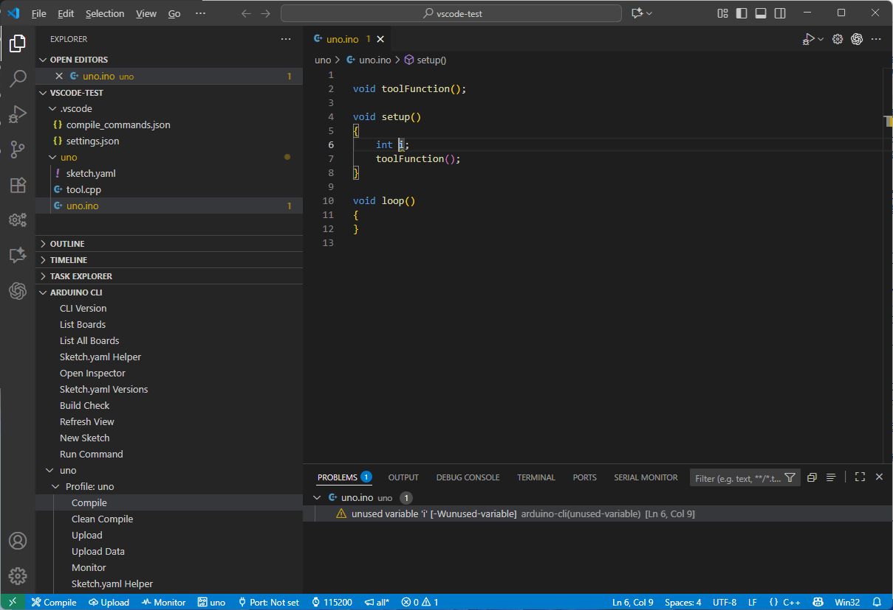
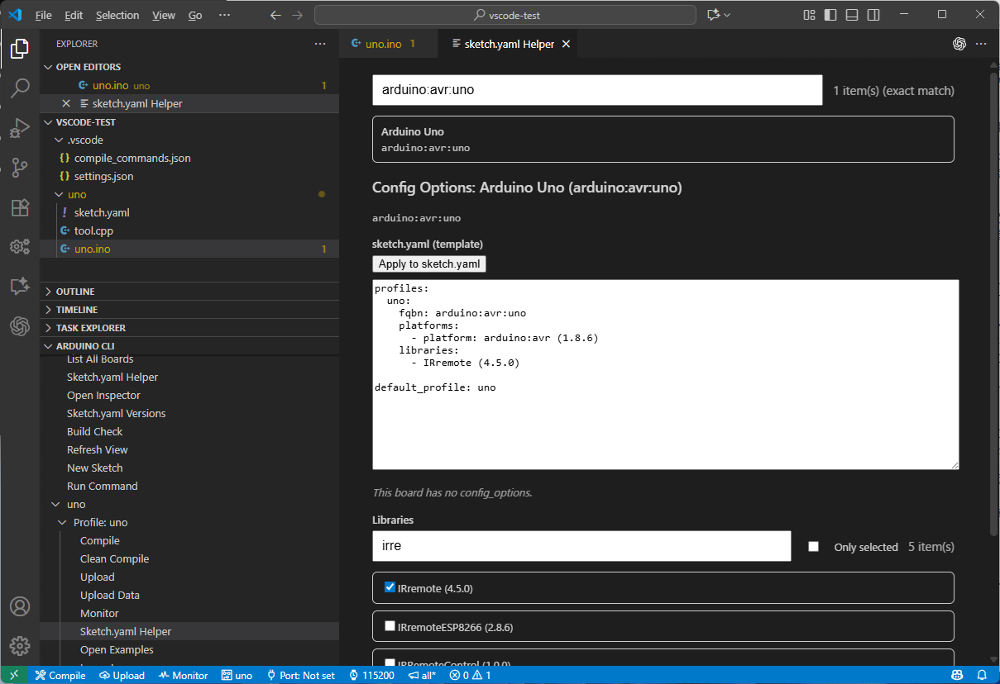
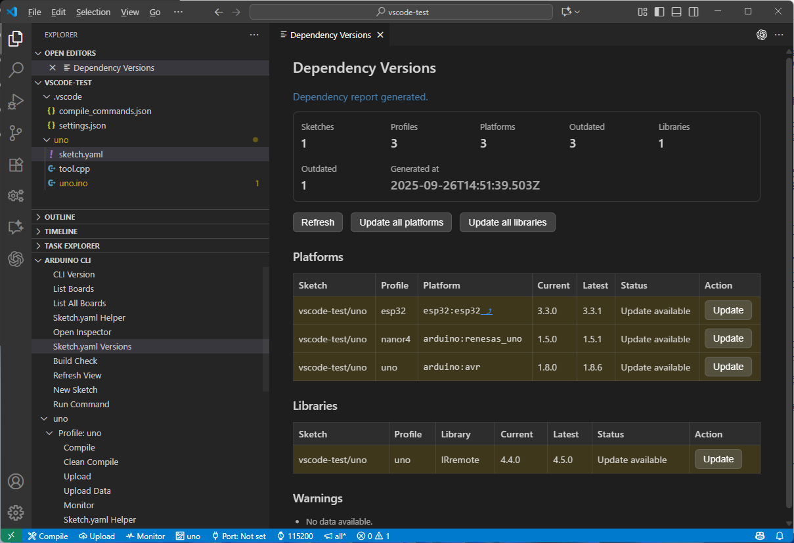
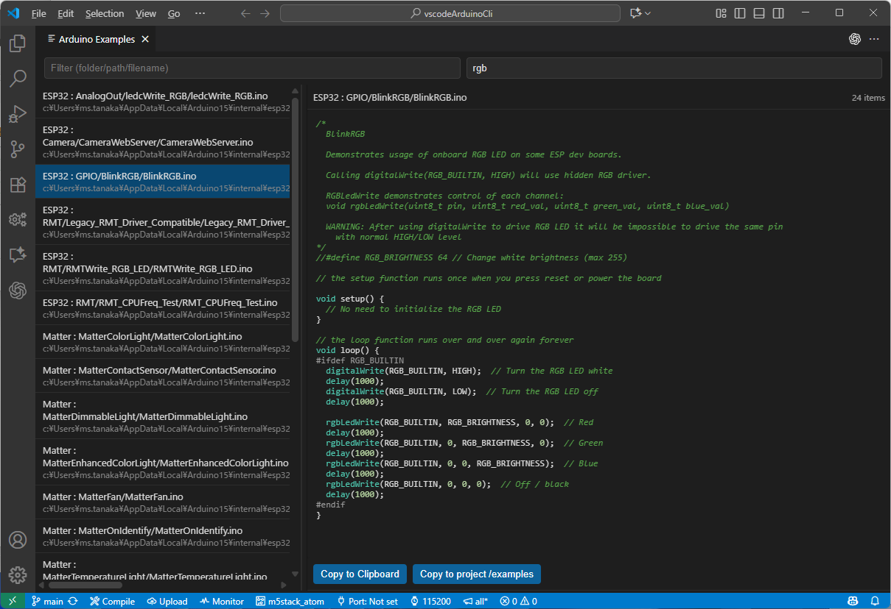
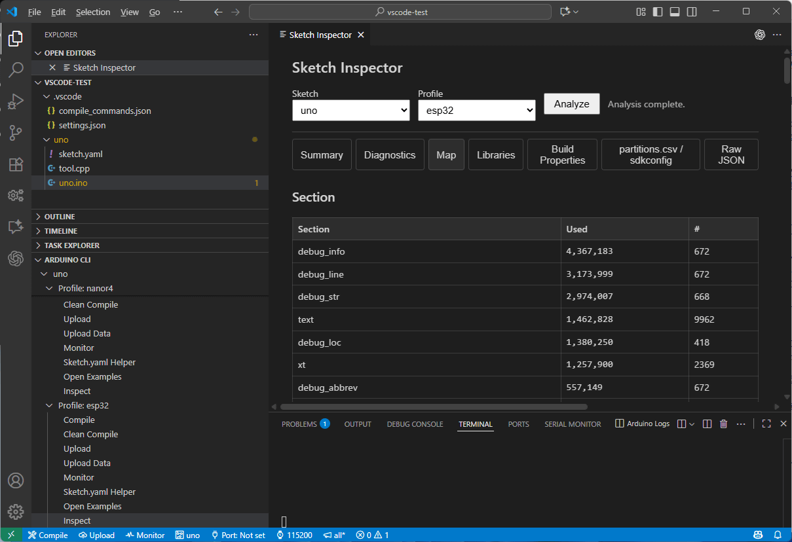

# Arduino CLI Wrapper (VS Code Extension)

[日本語READMEはこちら](README.ja.md)

VS Code extension to run Arduino CLI from the command palette, status bar, and an Explorer view. It streams colored logs to a pseudo terminal, supports sketch.yaml profiles, and updates IntelliSense includePath during builds.



*The Explorer view keeps sketches, profiles, and common actions together so you can launch tasks with a click.*

## Concept

This extension brings the Arduino CLI—normally invoked under the hood of the Arduino IDE—into VS Code so you can reach feature parity (and more) without leaving your editor. By leaning on Arduino CLI profiles, you can pin different versions of platforms and libraries per project through `sketch.yaml`, something that is hard to maintain inside the IDE alone. The helper UIs guide you through editing those profiles and even compare them with the latest releases to suggest upgrades.

Because you are already working inside VS Code, the extension connects build results with the Microsoft C/C++ extension: include paths, IntelliSense, diagnostics, and the generated `compile_commands.json` all stay in sync with each compile. You also get a workspace-focused warnings mode that filters out noise from third-party cores (addressing the IDE’s `none` default), plus exclusive utilities such as the ESP32 data uploader and the Inspector for analysing map and artifact files.

The goal is to make Arduino CLI approachable for beginners while unlocking the advanced workflows—multiple dependency versions, rich IntelliSense, and build automation—that seasoned users expect.

## Quick Start

1) Install Arduino CLI
- Put it in `PATH` or set a full path in the setting `arduino-cli-wrapper.path`.
- Confirm with "Arduino CLI: Check CLI Version" (a guide appears if not configured).
  - Windows: installer https://downloads.arduino.cc/arduino-cli/arduino-cli_latest_Windows_64bit.msi or `winget install ArduinoSA.CLI`
  - Linux: `curl -fsSL https://raw.githubusercontent.com/arduino/arduino-cli/master/install.sh | BINDIR=~/.local/bin sh`
  - macOS: `brew update && brew install arduino-cli`
    - See the official installation guide for additional options: https://arduino.github.io/arduino-cli/latest/installation/

### Recommended VS Code extensions

This extension declares an `extensionPack` so you can pull in the supporting tooling with one click. Install the extensions that match your workflow:

- **C/C++ (ms-vscode.cpptools)** – Delivers IntelliSense, navigation, and the default `cppdbg` debugger. It is part of a standard C/C++ environment, so we strongly encourage having it installed alongside this wrapper.
- **Cortex-Debug (marus25.cortex-debug)** – Adds advanced hardware-debug tooling such as register, peripheral, and memory views. Recommended when you rely on the debugger; optional if you only need lightweight or no debugging.

2) Open a sketch folder
- When a folder contains `.ino`, the status bar shows Compile/Upload/Monitor plus FQBN/Port/Baud/Warn.

3) Compile / Upload / Monitor
- Build: run "Arduino CLI: Compile Sketch" or click Compile.
- Upload: run "Arduino CLI: Upload Sketch" or click Upload. Select the serial port first; the extension passes `-p` explicitly even when using profiles.
- Monitor: run "Arduino CLI: Monitor Serial" or click Monitor. Baudrate defaults to 115200 and can be changed from the status bar.
  - Need a serial plotter? Install a VS Code extension such as [Teleplot](https://marketplace.visualstudio.com/items?itemName=teleplot.teleplot) or any preferred tool.

Tips:
- If multiple `.ino` files exist, a picker appears to choose one. If an `.ino` editor is active, it is preferred.
- If the FQBN cannot be inferred, you can enter one manually.

### Manage `arduino_secrets.h`

When an `.ino` file contains `#include "arduino_secrets.h"` the editor now shows an inline action directly above the include. Click it to open the secrets header if it already exists, or generate it on the spot when missing. The generator copies any fallback `#define` lines from the sketch's `#else` block so the new header starts with the same defaults, helping you move Wi-Fi credentials into an untracked file with a single click.

## Speeding up builds with WSL

If Arduino CLI builds feel slow on Windows, you can offload compilation to a Linux environment by using WSL (Windows Subsystem for Linux). This extension automatically detects that you are running inside WSL, uses the Linux `arduino-cli` for compile tasks, and still relies on `arduino-cli.exe` on Windows for upload/monitor so you do not have to configure serial ports twice. Follow the steps below.

1. **Install WSL and a Linux distribution**
   ```powershell
   # PowerShell (Admin)
   wsl --update
   wsl --install -d Ubuntu-24.04
   wsl --set-default-version 2
   ```
   Complete the first boot prompt by setting your Linux username and password. Skip this step if you already have WSL installed.

2. **Set up Arduino CLI inside WSL**
   ```bash
   # Inside your WSL terminal (Ubuntu)
   sudo apt update
   curl -fsSL https://raw.githubusercontent.com/arduino/arduino-cli/master/install.sh | BINDIR=~/.local/bin sh
   arduino-cli config init
   arduino-cli update
   ```
   Verify with `arduino-cli version`.

3. **Connect VS Code to WSL**
   - From the command palette select **Remote-WSL: New Window**, choose Ubuntu, and let VS Code reopen in WSL mode.
   - Install this extension in the WSL environment when prompted.
   - Leave `arduino-cli-wrapper.path` empty to auto-detect `/usr/local/bin/arduino-cli`, or set the full path explicitly if you prefer.

4. **Compile on Linux**
   - Open your sketch folder while connected to WSL and run **Arduino CLI: Compile Sketch**. Linux-side build outputs (e.g. under `/home/<user>/.arduino15/`) are created automatically.

5. **Upload / Monitor stay on Windows**
   - When you trigger Upload or Monitor, the extension switches to `arduino-cli.exe` on Windows, connecting to `COM` ports directly. No extra serial configuration inside WSL is required.

6. **Limitations for Upload Data and Debug**
   - `Arduino CLI: Upload Data` and `Arduino CLI: Debug` cannot access Windows-hosted serial ports from WSL. Choose one of these workarounds:
     1. Forward the USB device into WSL with `usbipd-win` so the port appears under `/dev/tty*`.
        ```powershell
        usbipd wsl list
        usbipd wsl attach --busid <BUSID>
        ```
        ```bash
        ls /dev/tty*
        ```
     2. Run those commands from Windows instead of WSL.

7. **Troubleshooting tips**
   - Seeing `Latest arduino-cli: (unknown)` usually means the GitHub API rate limit was exceeded. Set `GITHUB_TOKEN` in your environment or retry later.
   - If a `COM` port does not appear, confirm that Windows detects the board in Device Manager and reinstall drivers when necessary.

With this hybrid setup you get the best of both worlds: fast Linux-based builds and seamless serial access through Windows.

## Advanced customization

### Optional: `.arduino-cli-flags` (extension-only)

If you must inject extra `build.extra_flags` on every compile, you can place an `.arduino-cli-flags` file next to the sketch. **This feature is unique to Arduino CLI Wrapper and other IDEs or extensions will ignore it, so we recommend managing secrets and overrides via `arduino_secrets.h` or standard configuration first.** Treat it as an advanced escape hatch for experienced users who already understand the build pipeline.

- Write one flag per line, for example `-DWIFI_SSID="MySSID"`.
- Lines starting with `#` or `//`, as well as blank lines, are ignored.
- The remaining flags are joined with spaces and passed as a single `--build-property build.extra_flags=...` argument.
- If you already provide `build.extra_flags` via settings, tasks, or the command palette, that configuration takes precedence and the file is skipped.

Because the filename starts with a dot it stays hidden by default. Add it to source control ignore lists (the extension’s `.gitignore` already contains an entry) so credentials never leak into commits.

In addition, the extension injects the following preprocessor macros by default so sketches can consume the build host’s timezone without touching `.arduino-cli-flags`. Disable **Arduino CLI Wrapper › Inject Timezone Macros** if you prefer to manage these flags yourself.

- `CLI_BUILD_TZ_IANA` – IANA timezone identifier such as `Asia/Tokyo`.
- `CLI_BUILD_TZ_POSIX` – POSIX expression suitable for newlib’s `TZ` (e.g. `JST-9` or `PST8PDT,M3.2.0/2,M11.1.0/2`).
- `CLI_BUILD_TZ_OFFSET_SEC` – Current UTC offset in seconds.
- `CLI_BUILD_TZ_OFFSET_ISO` – ISO-style offset string such as `+09:00`.
- `CLI_BUILD_TZ_ABBR` – Short label for UI surfaces, for example `JST` or `PST/PDT`.

## Everyday operations and UI

### Getting started with commands (Command Palette)

Press **Ctrl+Shift+P** (or **Cmd+Shift+P** on macOS) and type “Arduino CLI:” to see the most common commands. Highlights:

- **Open Command Center** – Launches the dedicated webview with three tabs: a command overview, a configuration view for `arduino-cli config`, and management panels for cores and libraries (complete with install/update/uninstall buttons and filters). This is the fastest way to explore everything the extension exposes.
- **Check CLI Version** – Confirms that `arduino-cli` is installed and reachable. If it is missing, the extension shows a friendly setup guide.
- **Update Index** – Runs `arduino-cli update` to refresh board and library metadata. The command also runs automatically the first time you check the CLI version during a VS Code session.
- **Upgrade Cores/Libraries** – Executes `arduino-cli upgrade` so installed platforms and libraries pick up the latest releases from the refreshed index.
- **Board Details** – Shows the technical info for the currently selected profile/FQBN, making it easy to verify you picked the right board package.
- **Compile Sketch / Clean Compile / Upload Sketch** – Everyday build and upload automation. Clean Compile rebuilds with `--clean`, refreshing IntelliSense include paths so swapped libraries or platforms are reflected immediately.
- **Build Check** – Runs through every profile declared in `sketch.yaml`, compiling each with full warnings and presenting a consolidated summary of errors and warnings.
- **Debug Sketch** – Generates profile-aware debug assets; see “Debug your sketch (advanced)” for the full walkthrough before running it the first time.

### Status bar

- `$(tools) Compile`: compiles the `.ino` in the current workspace folder
- `$(cloud-upload) Upload`: uploads the `.ino` in the current workspace folder
- `$(pulse) Monitor`: opens the serial monitor
- `$(circuit-board) <FQBN/Profile>`:
   - Shows the profile you last selected via "Arduino CLI: Set Profile" or the Arduino CLI tree. If no profile is recorded but any `sketch.yaml` exists, it displays `Profile: Not set` and opens the profile picker. When no profile-enabled sketches are found, it falls back to the current FQBN and lets you change it via "Arduino CLI: Set FQBN".
- `$(plug) <Port>`: shows current serial port (click to change). Pick **External programmer (JTAG/SWD/ISP)** when you flash through a dedicated programmer so uploads skip passing `-p`.
- `$(watch) <Baud>`: shows current baudrate (click to change)
- `$(megaphone) <Warnings>`: shows compile warnings/verbose badge (click to pick combinations)

Status bar items are hidden when the workspace has no `.ino` files. FQBN/Port/Baud are stored per workspace and persist across restarts.

### Explorer view

- Adds an "Arduino CLI" view under Explorer.
- Lists detected sketch folders; shows profiles from `sketch.yaml` when available.
- Per project/profile actions: Compile, Upload, Debug, Upload Data, Monitor, Sketch.yaml Helper, Open Examples.
  - Debug appears on profile nodes only so you can launch the generated debug configuration for the selected profile in one click.
- Global actions at the top: Command Center, CLI Version, Sketch.yaml Helper, Open Inspector, Sketch.yaml Versions, Build Check, Refresh View, New Sketch.
- Sketch items display workspace-relative paths, and nodes are expanded by default.

## Build and upload fundamentals

- **Compile Sketch** – Builds the selected sketch. If the folder contains several `.ino` files, a picker helps you choose the right one. Profiles from `sketch.yaml` are applied automatically; otherwise the saved FQBN is used.
- **Clean Compile** – Runs the same build with `--clean`, resets IntelliSense include paths, and is handy when switching libraries or boards.
- **Local Build Path (setting)** – Turn on **Arduino CLI Wrapper › Local Build Path** to pass `--build-path` automatically and store build outputs in `.build/<profile>` under each sketch, keeping artifacts local for Compile, Upload, Inspector, and more.
- **Upload Sketch** – Compiles and uploads in one go. You will be prompted for a serial port if one is not already selected, and the monitor is closed/reopened as needed so the port stays free.
- **OTA uploads (network ports)** – If the selected port looks like an IP address, the extension assumes an OTA transfer and injects `--upload-field password=$ARDUINO_CLI_OTA_PASSWORD`. The actual CLI call expands the environment variable (leave it empty when no password is required) while the Arduino Logs channel keeps the literal `$ARDUINO_CLI_OTA_PASSWORD` string so credentials never appear in clear text.
- **Build Check** – Compiles every profile defined in `sketch.yaml` with full warnings (`--warnings all`), then shows a summary of warnings and errors so you can spot regressions quickly.
- **Run in Wokwi** – When a `sketch.yaml` profile sets `wokwi: true`, compiling that profile exports `.wokwi/<profile>/wokwi.elf`, scaffolds board-aware defaults for `diagram.json` / `wokwi.toml`, and adds a "Run in Wokwi" action that opens the diagram in the official simulator extension.

## Sketch management and utilities

### Keep sketches organised

- **Sketch.yaml Helper** – Opens a helper view where you can review or update board packages, platforms, and libraries without editing YAML by hand.
- **Check Sketch.yaml Versions** – Audits every profile against the official indexes and offers inline upgrades when newer versions are available.
- **New Sketch** – Creates a fresh sketch folder, opens the generated `.ino`, and launches the helper so you can configure profiles immediately.



*Use the Sketch.yaml Helper to edit profiles without touching raw YAML.*



*See which platforms and libraries have updates pending and apply them in place.*

### Explore examples quickly

- **Browse Examples** – Opens a tree of every example sketch exposed by your installed cores and libraries. Unlike the Arduino IDE, you can preview the source before opening it in the editor, switch between the `.ino`, README, and other files via tabs above the viewer, and copy the entire example folder into your project with a click.
- **Filter by name or folder** – Use the quick filter box to narrow the list by file or directory names when you already know what you are looking for.
- **Search inside sketches** – Switch to the built-in grep mode to filter examples by the text they contain (for instance, type `rgb` to find examples that manipulate RGB LEDs or look for a specific function call).
- **Open with one click** – Once the preview matches what you need, open it directly in the editor and start adapting it to your project.



*Browse, filter, and preview Arduino examples without leaving VS Code.*

### Fine-tune your tooling

- **Monitor Serial** – Opens a serial terminal with selectable port and baudrate (default 115200). Helpful tips appear if the port is busy.
- **Configure IntelliSense** – Regenerates `.vscode/c_cpp_properties.json` using the latest compiler flags without running a build.
- **Run Command** – Lets you pass custom arguments straight to `arduino-cli` when you need an advanced flag that the UI does not expose.
- **Inspector** – Examines the generated map file, ELF sections, and other build artifacts so you can understand memory usage at a glance. Use the **Clean build (--clean)** toggle when you need a fresh compile; it defaults to off so quick inspections reuse the existing build.
- **Status controls in the status bar** – Toggle warning levels (`none`, `workspace`, `default`, `more`, `all`) and the `--verbose` switch. The badge (for example `all+V`) updates instantly.
- **Include Order Lint** – Watches `.ino` files and warns if filesystem headers appear before M5GFX headers, catching a common runtime pitfall.



*Run the Inspector after a build to review memory usage and section breakdowns.*

All command logs are unified in a dedicated pseudo terminal with ANSI colors so you can follow the exact CLI invocation.

## Profiles and data flashing

### Upload Data (ESP32)

- Requires a `data/` folder under your sketch directory and an ESP32 filesystem include in the sketch (`#include <LittleFS.h>` or `#include <SPIFFS.h>`).
- Builds an image via `mklittlefs` or `mkspiffs` and flashes it with `esptool` to the SPIFFS partition.
- Reads tool paths and upload speed from `arduino-cli compile --show-properties` and parses `partitions.csv` in the build output to find offset/size.
- Closes an open serial monitor before flashing and reopens it after.

#### Embed assets or upload a data image?

**Arduino CLI: Embed Assets** is the quickest option: open the Arduino CLI explorer, use the `Embed Assets` action in the profile section (it appears above `Upload Data`), drop files under `assets/` or any sketch-root folder whose name starts with `assets_` (for example `assets_wifi/` or `assets_ui/`), and the extension regenerates `<folder>_embed.h` with a `PROGMEM` byte array and length constant for each file. Each header reuses the folder name for the exported arrays and symbols (`assets_wifi_file_names`, etc.) so multiple asset bundles can coexist. If the base `assets/` folder is missing, the manual action still creates it for you; compile-time auto-regeneration continues to skip headers when their source folder doesn't exist so builds no longer recreate them unexpectedly. Add a `.assetsignore` file inside each assets folder to skip files or directories with gitignore-style rules (e.g., use `# comment`, `foo/`, `*.psd`, `**/tmp/**`, `!important.bin`), and the generator will only embed the files you keep. Unicode or symbol-heavy filenames are still embedded; the extension now hashes those paths to create valid, unique C++ identifiers automatically.

Need more control? Drop an `.assetsconfig` file next to `.assetsignore` and describe how the folder should be processed using the INI-style sections shown below:

```
[general]
# Relative directory (from assets/) where the generated header is written
dir = ../
# Filename for the generated header (directory comes from dir)
header_name = assets_generated.h
# Optional symbol prefix; defaults to the folder name
prefix = assets_wifi

[minify]
enable = true      ; master switch
html = true        ; html/css/js toggles
css = true
js = true
keep_comments = false
write_output_file = false
output_dir = .assets_minified

[gzip]
enable = true
patterns = **/*.html, **/*.css, **/*.js
min_size = 256
suffix = .gz
```

`dir` is resolved relative to the assets folder (blank entries fall back to `../`, which targets the sketch root), while `header_name` only controls the filename. The minifier is lightweight and regex-based—great for trimming whitespace/comments from small bundles, but not a full parser—so keep `keep_comments = true` if you rely on tricky constructs. If you enable `write_output_file`, remember to add the specified `output_dir` to `.assetsignore` so those intermediate files don’t get embedded on the next run. When gzip is enabled, files that match `patterns` (glob, comma separated) and exceed `min_size` bytes are minified first and then compressed; the generated filename appends `suffix`. Both `.assetsconfig` and `.assetsignore` are excluded from the embed output automatically.

The trade-off is size: every embedded byte becomes part of the sketch binary. Large media files make the firmware heavier, so each upload or OTA update takes longer, and you can run into partition limits.

**Arduino CLI: Upload Data** takes the opposite approach. You upload a filesystem image from `data/` once, but afterward the sketch can be rebuilt or flashed without re-sending those files, keeping OTA and serial uploads small. For large or frequently changing assets—especially with OTA workflows—prefer the data image so the firmware stays lean. Reserve Embed Assets for lightweight bundles where the convenience outweighs the extra firmware size.

### sketch.yaml and Profiles

- When `sketch.yaml` exists, compile/upload use profiles; otherwise FQBN is used.
  - To bootstrap a `sketch.yaml`, use the Helper view to generate a template for your board and libraries, then copy it into a new `sketch.yaml` in your sketch folder.
- The status bar FQBN indicator switches to a profile name if profiles exist. Use "Arduino CLI: Set Profile" to change it.
- "Sketch.yaml Helper" shows a helper UI to inspect/apply FQBN, libraries, and platform info for a selected profile.
- Profiles with `wokwi: true` automatically maintain `.wokwi/<profile>/wokwi.elf`, `diagram.json`, and `wokwi.toml` after each compile so the Wokwi extension can simulate the latest firmware. The generated `diagram.json` seeds board-specific layouts (UNO, MEGA, Nano, ESP32 S3 Box, M5Stack CoreS3, Seeed XIAO ESP32 families, and generic ESP32).

## Debug your sketch (advanced)

- **Debug Sketch** – Generates matching tasks and launch configurations for each profile by reusing the board’s debugger metadata discovered through Arduino CLI. If Cortex-Debug is installed it launches a `cortex-debug` session; otherwise it falls back to the Microsoft C/C++ debugger with `request: "launch"` already set so the old “select a process to attach” prompt no longer appears.

### Step-by-step workflow

1. **Pick the profile and environment.** Set the profile you want to debug as the default in `sketch.yaml` (or be ready to pick it when prompted) and double-check related settings such as the serial port or Local Build Path so the generated tasks line up with your hardware.
2. **Run “Arduino CLI: Debug Sketch”.** Choose the sketch and target profile when prompted. The command produces two artefacts under `.vscode/`:
  - `tasks.json` gains **Arduino: Debug Build & Upload …** so you can flash the firmware with the probe attached. The task honours the Local Build Path setting and the profile’s CLI arguments.
  - `launch.json` gains a Cortex-Debug entry (if the extension is installed) and a Microsoft C/C++ fallback. The extension lifts the necessary OpenOCD and GDB settings straight from Arduino CLI output, and the cppdbg variant always sets `"request": "launch"` to skip the old “select process” prompt.
   Run this command at least once per profile—the generated files are required before any debug session can start. Re-run it whenever cores, board packages, or tool versions change so the tasks stay in sync with the data discovered from Arduino CLI.
   While generating these files the extension parses `arduino-cli compile --show-properties` and related board metadata so the launch settings mirror your CLI environment. Once the files are refreshed the extension immediately runs the Arduino CLI debug build task and launches the matching configuration, dropping you into a halted session without extra clicks—the first breakpoint is Arduino’s `thb setup`, so you start paused at `setup()`.
  The first run rebuilds every translation unit with debug options, so expect a noticeably longer compile. VS Code might show a dialog such as “Waiting for preLaunchTask 'Arduino: Debug Build & Upload MyProject (debugProfile)'…” (sketch/project and profile names vary); ignore the **Debug Anyway** button and just wait—once the pre-launch task finishes, the upload completes and the debugger starts automatically.
3. **Keep configurations fresh.** Rerun **Arduino CLI: Debug Sketch** whenever you change hardware, switch profiles, or update Arduino CLI/tooling—the command regenerates tasks, rewrites launch settings, and starts a new debug session so everything stays aligned.
4. **Reuse the generated setup.** When nothing has changed since the last run, you can start debugging from the Run and Debug view or by pressing **F5**; both paths reuse the configuration and build output created by the command.
5. **Customise if needed.** You can edit the generated `launch.json`—for example to change `overrideAttachCommands`, add semihosting commands, or point to a different SVD file. The wrapper will merge the next regeneration, keeping manual tweaks where possible. If you replace toolchains, rerun the command so it captures the new paths directly from Arduino CLI.

Tips:
- The extension owns the debugger configuration. Each run of **Arduino CLI: Debug Sketch** parses `arduino-cli compile --show-properties` and related board metadata, so you never have to maintain debugger arguments manually.
- The extension keeps the Arduino Logs terminal in focus during the debug build so you can see OpenOCD output.
- Leaving the probe connected while running **Compile Sketch** or **Upload Sketch** is safe; they now use the same build path as the debug task, so the ELF selected in `launch.json` always matches the latest upload.

## IntelliSense and developer tooling

### IntelliSense

- During builds, the extension parses compiler lines (`-I`, `-isystem`, `-iprefix`) and updates `.vscode/c_cpp_properties.json` (configuration `Arduino`). While the build runs, it only appends newly discovered paths to minimize churn; when the build finishes, it prunes unused and non-existent entries.
- Clean builds reset `includePath` first, then add only discovered paths.
- For ESP32 family (esp32/xtensa-esp32/riscv32-esp-elf), it prefers `c17` / `c++23`.
- "Configure IntelliSense" computes include paths and writes `c_cpp_properties.json` without triggering a build.

### compile_commands.json for clangd and CMake Tools

If you use tools such as clangd, CMake Tools, or the VS Code C/C++ extension in "use compile commands" mode, you can point them at the file generated by this extension.

1. Run **Arduino CLI: Compile Sketch** at least once so the build output is available.
2. The wrapper writes `.vscode/compile_commands.json` next to your workspace root. Each time you build, the file is refreshed automatically.
3. Every command from the Arduino CLI build and from your workspace sources is included—headers in the sketch folder, generated sources under the build directory, and more.
4. Entries produced from temporary `.ino.cpp` files are rewritten to the original `.ino` filename, and the `file` column only keeps the file name (no absolute paths). This keeps diffs stable when the workspace lives in different locations.

Point clangd or other tools to `<workspace>/.vscode/compile_commands.json` and they will pick up the same flags the Arduino CLI used, without extra configuration.

## Settings

- `arduino-cli-wrapper.path`: Path to the `arduino-cli` executable
- `arduino-cli-wrapper.additionalArgs`: Extra arguments appended to every invocation (array)
- `arduino-cli-wrapper.localBuildPath`: Forces `--build-path` to `.build/<profile>` inside the sketch so build artifacts stay alongside the project
- `arduino-cli-wrapper.verbose`: Adds `--verbose` to compile/upload (mirrors the status bar toggle)
- `arduino-cli-wrapper.compileWarnings`: Warning level passed to `arduino-cli compile` (`--warnings`, mirrors the status bar toggle)
- `arduino-cli-wrapper.lint.m5gfxIncludes`: Header list treated as M5GFX family for include-order linting
- `arduino-cli-wrapper.lint.fsIncludes`: Header list treated as filesystem-related for include-order linting

## Include Order Lint

- Applies to `.ino` files in the workspace.
- When an M5GFX header (from `arduino-cli-wrapper.lint.m5gfxIncludes`) appears before a filesystem header (from `arduino-cli-wrapper.lint.fsIncludes`) in the same translation unit, the extension emits an error diagnostic.
- The default header lists cover the common M5GFX and filesystem headers; customize them per project via the settings above.
- Diagnostics refresh automatically as documents change or when the settings are updated.

## Requirements

- VS Code 1.84.0+
- Arduino CLI installed locally

## Troubleshooting

- Executable not found: set a full path in `arduino-cli-wrapper.path`.
- Board not detected: check cable/driver/port, and run "Arduino CLI: List Connected Boards".
- Upload Data: ensure `data/` exists and the sketch includes `SPIFFS.h` or `LittleFS.h`.

## Third-Party Notices

- Highlight.js (core, cpp grammar, VS2015 theme) (c) 2006-2023 the highlight.js authors, BSD-3-Clause. [License](https://github.com/highlightjs/highlight.js/blob/main/LICENSE)

## License

CC0 1.0 Universal (Public Domain Dedication). See `LICENSE`.
